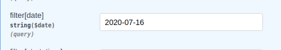

# MirrorAppInterviewTask

# Задание: 

        Пётр и Антон решили открыть свой бизнес по выгулу собак в своем доме.
        Они решили разработать приложение через которое жильцы дома смогут направлять им заказы на выгул своих питомцев.
        Петру и Антону срочно нужен бэкенд разработчик, который поможет им разработать структуру БД и реализовать REST-API.
        И этим бэкенд разработчиком будете вы. 

        Пётр и Антон сформировали ряд требований:
            +1. В заказе необходимо сохранять номер квартиры, кличку и породу животного, время и дату прогулки.
            +2. Прогулка может длиться не более получаса. Прогулка может начинаться либо в начале часа, либо в половину 
                    (11:00,11:30,12:00,12:30…).
            +3. Самая ранняя прогулка может начинаться не ранее 7-ми утра, а самая поздняя не позднее 11-ти вечера.
            +4. Пётр и Антон каждый могут гулять одновременно только с одним животным. 

        В API необходимо реализовать 2 метода:
            1. Вывод уже оформленных заказов на указанную дату
            2. Оформление заказа


## Запуск 

1. Заполняем нужными конфигами файл ./mirror_back/.env.docker
      ```
      POSTGRES_USER=postgres
      POSTGRES_PASSWORD=qwerty
      ```
2. Запуск через докер ./
   ```
      sudo docker-compose build
      sudo docker-compose up
   ```
   
3. Документация: 
   ```
      http://0.0.0.0:8084/api/mirror-back/docs
   ```

## Нюансы
1. Вывод уже оформленных заказов на указанную дату происходит засчет фильтрации поля date (остальные поля не подключены)
